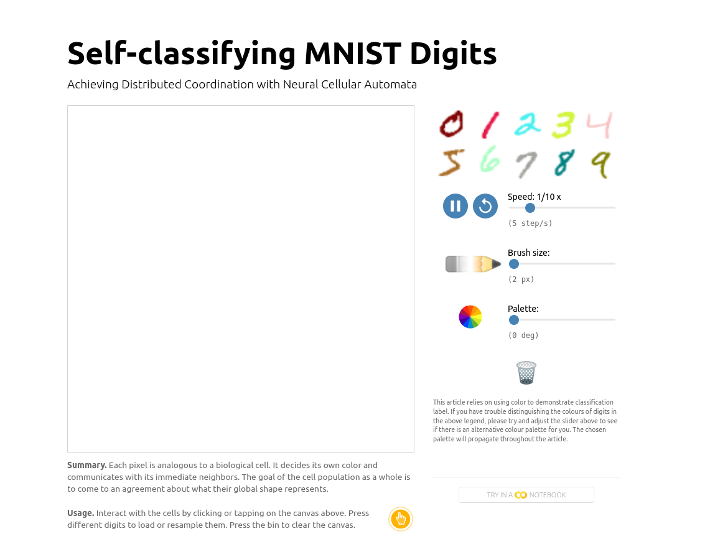

# Flask-Redis-Docker Site

This project ties together [Flask](http://flask.pocoo.org), [Redis](http://redis.io) and [Docker](http://docker.com) in a simple demo application. It can serve as template to build a simple web site while managing it all with [docker-compose](http://docs.docker.com/compose).

It allows to draw self-classifying MNIST digits using a local differential "cell communication" rules. The demo was inspired and partially adapted from the great [distill.pub](https://distill.pub/2020/selforg/mnist/) article $-$ I highly recommend to check it out!

## Screenshot



## Quickstart

Clone the repository, cd into it and run
```bash
sudo docker-compose build
sudo docker-compose up -d
```

point your browser to http://localhost:5555 == http://0.0.0.0:5555. 

## Docker containers

For each component of this project a separate docker container is afforded, controlled ("orchestrated") by docker-compose.

For the sake of simplicity, the same image is used for the separate containers. The image stems from [python:3.9](https://hub.docker.com/_/python), which contains a debian 9 linux. Instead of debian a more lightweight image like alpine could also be used.

The are four containers in this project at work.
* server: where are Flask web application runs
* redis: containing the redis server

The image is build from `project/Dockerfile`. This one Dockerfile includes all the necessary python components and their dependencies from `project/requirements.txt`.

For the redis server container the out-of-the-box [redis](https://hub.docker.com/_/redis) image is used $-$ not much use building a image for redis by ourself.


## Working with containers

Following the log of a specific container
```bash
sudo docker-compose logs -f server
```

Getting a shell in a container
```bash
sudo docker-compose exec -i -t server /bin/bash
```

Stopping containers and cleaning up
```bash
sudo docker-compose down --volumes
```
